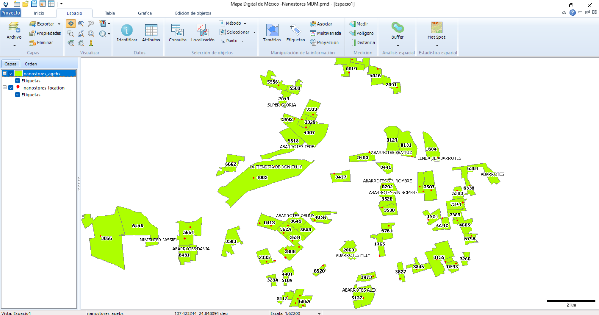

# AGEB locator: Python Tool for Retrieving AGEB Indicators from GPS Coordinates of Nanostores
This repository provides a Python-based tool designed to locate the AGEB (Basic Geostatistical Area) for a nanostore based on its GPS coordinates. By inputting latitude and longitude data, the tool returns AGEB indicator that can later be link to the information on nanostores from INEGI. 

Features:
* Simple Python interface for retrieving AGEB indicator.
* Use GPS coordinates of a nonasotore to identify the AGEB region.

## Prerequisites

- Python 3.12 (tested on)
- Shapefile of region ([you can download it from INEGI](https://www.inegi.org.mx/temas/mg/))

## Installation

1. Clone the repository and navigate to the project directory
```bash
git clone https://github.com/ivanps/AGEB_Nanostore.git
```

```bash
cd AGEB_Nanostore
```
2. Copy the Shapefile from INEGI in the folder AGEBs.
3. Copy a file CSV con the ID of nanostores and their GPS location. The file should have the GPS location in the columns Latitud y Longitud. File 'Nanostores_location.csv'.
4. Run the code in AGEB_Locator.ipynb.
5. The nanostore location output is save in the file 'AGEB_Nanostores.csv'.

## Mapa Digital de México

El Mapa Digital de México es una plataforma desarrollada por el Instituto Nacional de Estadística y Geografía (INEGI) que permite a los usuarios explorar y analizar información geográfica de manera accesible y gratuita. Aunque no es tan avanzado como software de sistemas de información geográfica (SIG) profesional como ArcGIS, el Mapa Digital de México ofrece una variedad de herramientas esenciales para la visualización y manipulación de datos espaciales.

Este software permite trabajar con capas de información de distintas categorías, como límites territoriales, red de carreteras, hidrografía, uso de suelo, y estadísticas demográficas, entre otros. Además, permite visualizar las Áreas Geoestadísticas Básicas (AGEB) y consultar indicadores socioeconómicos asociados a cada área. Al ser una herramienta gratuita y de fácil uso, es ideal para quienes desean realizar estudios de geografía y análisis espacial en México sin necesidad de invertir en licencias de software SIG avanzadas.

Con el Mapa Digital de México, investigadores, estudiantes, y tomadores de decisiones pueden acceder a datos oficiales y actualizados para analizar patrones espaciales, realizar mapas temáticos, y obtener información relevante para proyectos de desarrollo urbano, planeación territorial, y estudios ambientales.

The app can be downloaded from [this site in INEGI](https://www.inegi.org.mx/temas/mapadigital/#Descargas).

The following image shows an example.
